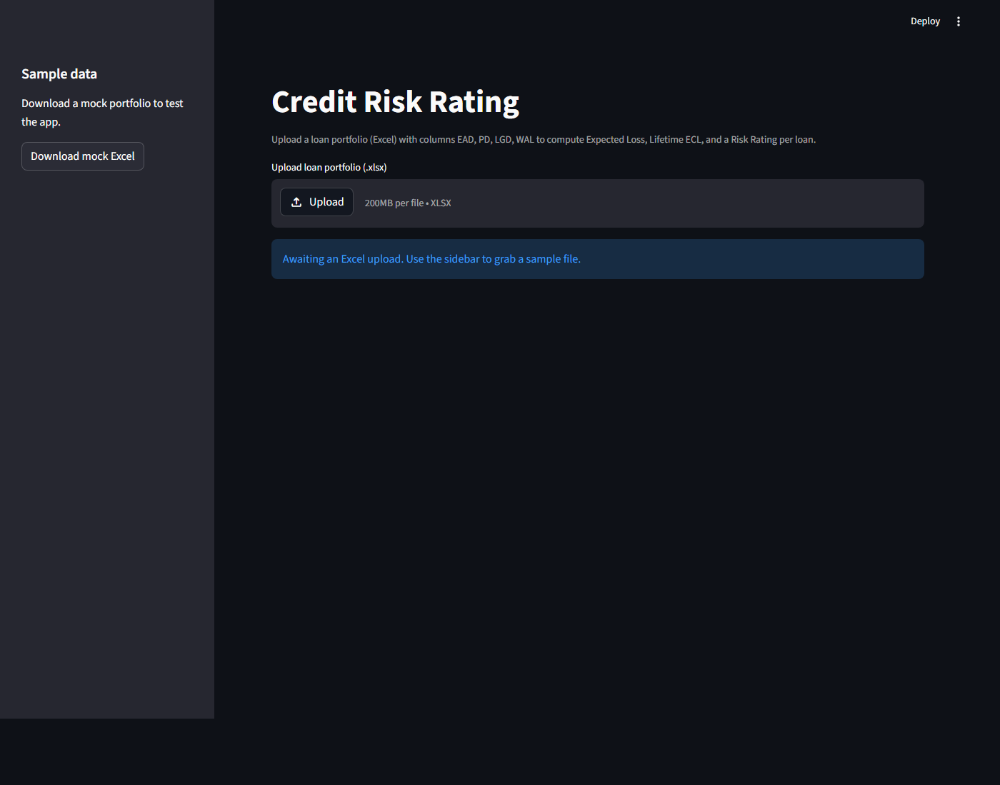

# Credit Risk Rating

A Streamlit web app that ingests a loan portfolio (Excel) and computes per-loan
**Expected Loss**, **Lifetime ECL**, and a **Risk Rating** (`Low` / `Medium` /
`High` / `Critical`) from the four standard IFRS 9 credit risk inputs:
EAD, PD, LGD, and WAL.

**Live demo:** <https://creditloananalysis.streamlit.app/>



## Features

- Upload a `.xlsx` portfolio with `EAD`, `PD`, `LGD`, `WAL` columns
- Automatic input cleaning: drops NaN rows, clips `PD`/`LGD` to `[0, 1]`,
  warns on non-positive `EAD`
- Portfolio-level summary: total EAD, total Expected Loss, total Lifetime ECL,
  weighted-average PD
- Risk-rating distribution chart and an enriched per-loan table
- Download the enriched results back as Excel
- One-click mock portfolio in the sidebar to try the app without your own data

## How the numbers are computed

For each loan:

```
Expected_Loss = EAD * PD * LGD
ECL_Lifetime  = Expected_Loss * WAL
Loss_Ratio    = PD * LGD
```

`Risk_Rating` is then assigned from `Loss_Ratio`:

| Loss Ratio        | Rating   |
| ----------------- | -------- |
| `< 0.01`          | Low      |
| `< 0.05`          | Medium   |
| `< 0.15`          | High     |
| `>= 0.15`         | Critical |

## Quick start

Requires Python 3.13+.

```bash
# install deps
pip install -r requirements.txt

# run
streamlit run app.py
```

Then open <http://localhost:8501>, click **Download mock Excel** in the
sidebar, and re-upload it to see a populated dashboard.

## Project layout

```
app.py                     # Streamlit entry point + UI
src/excel_handler.py       # Read / validate / write .xlsx
src/risk_calculator.py     # Per-loan EL, ECL, Loss Ratio, Risk Rating
src/portfolio.py           # Portfolio-level summary aggregation
src/mock_data.py           # Sample portfolio generator
requirements.txt
pyproject.toml
```

## Input schema

| Column | Meaning                          | Range       |
| ------ | -------------------------------- | ----------- |
| `EAD`  | Exposure At Default (currency)   | `> 0`       |
| `PD`   | Probability of Default           | `[0, 1]`    |
| `LGD`  | Loss Given Default               | `[0, 1]`    |
| `WAL`  | Weighted Average Life (in years) | `>= 0`      |

Extra columns are preserved and shown in the enriched table.
